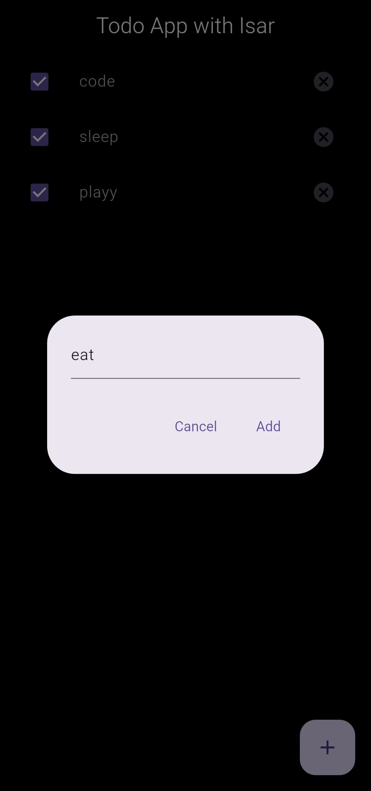

# 📱 TodoApp w ISARdb

A Flutter-based mobile application built with clean architecture principles, using **BLoC** for state management and **ISAR** as the local NoSQL database solution.

---

## 🚀 Features

- ✅ Clean and maintainable code using **BLoC** pattern
- 💾 High-performance local storage with **ISAR database**
- 🌐 Modern, responsive UI built with Flutter
- ⚡ Fast, offline-first experience

---
## 📱 App Images




---

## 🛠️ Technologies Used

| Tech        | Description                             |
|-------------|-----------------------------------------|
| Flutter     | UI toolkit for building native apps     |
| Dart        | Language used for Flutter development   |
| BLoC        | Business Logic Component (State Mgmt)   |
| ISAR        | Ultra-fast NoSQL DB for Flutter apps    |

---

### 🚚 Installation

1. **Clone the repository:**
   ```bash
   git clone https://github.com/sandy4242/TodoApp-w-IsarDB
   cd TodoApp-w-IsarDB


